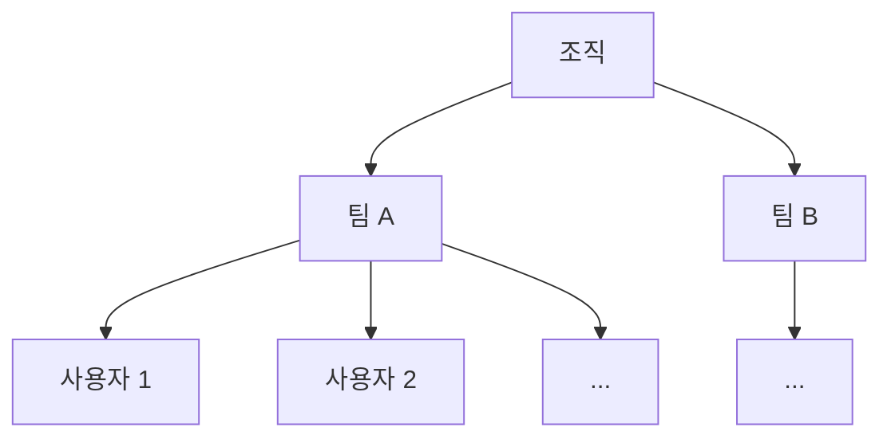
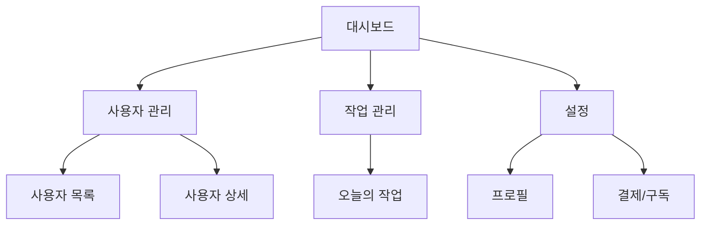
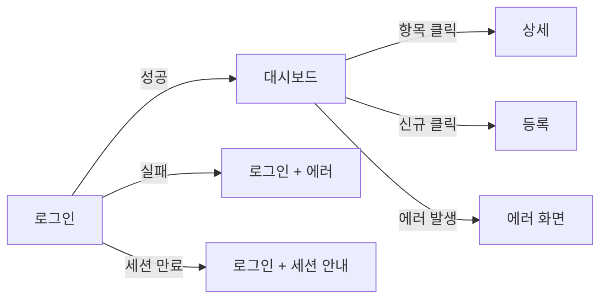

# PRD (Product Requirements Document) 템플릿 v1.1

> **이 템플릿이 다루는 것**
>
> 이 PRD는 단순히 "표준 섹션을 빈칸 채우기"가 아니라, **솔루션을 만들 때 빼먹으면 다음 단계가 무너지는 결정들을 능동적으로 발굴하는 도구**다. 다국어, 가격 정책, 멀티테넌시, 데이터 격리, 권한, 백업 같은 항목들은 *늦게 발견되면 마이그레이션 지옥*으로 직결된다. 각 섹션 끝의 *"빼먹기 쉬운 결정 점검"* 블록은 그 발굴을 강제하기 위한 장치다.

> **이 템플릿의 예시**
>
> 본 템플릿의 예시(SaaS 도메인, 치과 SaaS, 환자 관리, 관리자 대시보드 등)는 *형태를 보여주기 위한 illustrative*이며, 실제 PRD 작성 시 자기 도메인의 값으로 대체한다. 예시 문자열을 *룩업 테이블*처럼 그대로 가져다 쓰지 않는다.

> **이 템플릿의 사용법**
> - 이 문서는 PO(서비스 기획자) 모자를 쓰고 작성하는 산출물이다. PM 모자(일정, 게이트, 검증)는 별도 트랙으로 관리한다.
> - 9개 섹션을 모두 채워 완성한다. 단, **작성 순서는 목차 순서가 아니다.** 권장 작성 순서: **2 → 4 → 6 → 5 → 7 → 8 → 9 → 3 → 1**
>   - 인터랙티브 작성 모드(AI 초안 ↔ 사람 비판)에서는 이 순서가 *권장*일 뿐 강제는 아니다. 사용자가 컨텍스트를 더 가진 섹션부터 가도 된다.
> - **시나리오(6)와 유스 케이스(5)는 반복 갱신된다.** 시나리오를 펼치며 발견한 동작은 유스 케이스 매트릭스로 반영하고, 매트릭스의 빈 셀은 다시 새 시나리오를 트리거한다. 한 방향이 아니라 양방향이다.
> - 모든 미결정 항목은 비워두지 말고 **`[미결정: 결정자 / 시한]`** 형식으로 명시한다.
> - 모든 가정은 **`[가정: ... / 검증자 / 시한]`** 형식으로 명시한다.
> - 사람의 검증이 반드시 필요한 항목(특히 LLM이 초안을 만든 자리)은 **`[검증필요: 검증자 / 시한]`** 형식으로 명시한다.
> - 이 PRD는 살아있는 문서다. 버전을 올려가며 갱신한다.

> **이 템플릿이 다루지 않는 것** (= 별도 산출물 트랙)
> - 시스템 설계 3종(+1): ERD, 인프라 아키텍처 + CI/CD, API 명세, IA 및 내부 구조도
> - 기능 명세서(Functional Spec): Feature별 상세 동작 명세
> - 와이어프레임 / 화면 저밀도 설계
> - WBS / 일정 트래킹 / 미팅 로그
> - 비즈니스 흐름도 / 시퀀스 다이어그램 (PRD 작성 시 1차, 마지막에 1차 갱신 — 별도 트랙 유지)

---

## 목차

- [섹션 1. 문서 메타데이터](#섹션-1-문서-메타데이터)
  - [1.1. 문서 정보](#11-문서-정보)
  - [1.2. 변경 이력](#12-변경-이력)
  - [1.3. 빼먹기 쉬운 결정 점검](#13-빼먹기-쉬운-결정-점검-섹션-1)
- [섹션 2. 배경과 문제 정의](#섹션-2-배경과-문제-정의)
  - [2.1. 한 줄 정의](#21-한-줄-정의)
  - [2.2. 문제 정의](#22-문제-정의)
  - [2.3. 왜 *지금* 만드는가 (Why Now)](#23-왜-지금-만드는가-why-now)
  - [2.4. 빼먹기 쉬운 결정 점검](#24-빼먹기-쉬운-결정-점검-섹션-2)
- [섹션 3. 목표와 성공 지표](#섹션-3-목표와-성공-지표)
  - [3.1. 제품 목표 (2-4개 권장)](#31-제품-목표-2-4개-권장)
  - [3.2. 성공 지표 (Primary)](#32-성공-지표-primary--목표당-1개)
  - [3.3. Guardrail 지표](#33-guardrail-지표-떨어지면-안-되는-보호선)
  - [3.4. 지표 운영 원칙](#34-지표-운영-원칙)
  - [3.5. 빼먹기 쉬운 결정 점검](#35-빼먹기-쉬운-결정-점검-섹션-3)
- [섹션 4. 사용자 정의 (Personas / Roles)](#섹션-4-사용자-정의-personas--roles)
  - [4.1. 페르소나 (의사결정용)](#41-페르소나-의사결정용)
  - [4.2. 조직 구조](#42-조직-구조)
  - [4.3. 행위자 목록 (Actor List)](#43-행위자-목록-actor-list)
  - [4.4. 라이프사이클](#44-라이프사이클)
  - [4.5. 명시적 비대상 사용자 (Out of Persona)](#45-명시적-비대상-사용자-out-of-persona)
  - [4.6. 빼먹기 쉬운 결정 점검](#46-빼먹기-쉬운-결정-점검-섹션-4)
- [섹션 5. 유스 케이스 목록 (Use Cases)](#섹션-5-유스-케이스-목록-use-cases)
  - [5.1. 권한 매트릭스 (Authorization Matrix)](#51-권한-매트릭스-authorization-matrix)
  - [5.2. 조건부 권한 상세](#52-조건부-권한-상세)
  - [5.3. 유스 케이스 목록](#53-유스-케이스-목록)
  - [5.4. 빼먹기 쉬운 결정 점검](#54-빼먹기-쉬운-결정-점검-섹션-5)
- [섹션 6. 시나리오 (User Flows / Business Flows)](#섹션-6-시나리오-user-flows--business-flows)
  - [6.1. 시나리오 작성 원칙](#61-시나리오-작성-원칙)
  - [6.2. 사용자 시나리오 (User Flows)](#62-사용자-시나리오-user-flows)
  - [6.3. 비즈니스 시나리오 (Business Flows)](#63-비즈니스-시나리오-business-flows)
  - [6.4. 분기/예외 시나리오 목록](#64-분기예외-시나리오-목록)
  - [6.5. 결정 필요 항목 통합](#65-결정-필요-항목-통합)
  - [6.6. 빼먹기 쉬운 결정 점검](#66-빼먹기-쉬운-결정-점검-섹션-6)
- [섹션 7. 정보 구조와 화면 흐름 (IA + Screen Flow)](#섹션-7-정보-구조와-화면-흐름-ia--screen-flow)
  - [7.1. 정보 구조 (Information Architecture)](#71-정보-구조-information-architecture)
  - [7.2. 화면 목록](#72-화면-목록)
  - [7.3. 화면 흐름 (Screen Flow)](#73-화면-흐름-screen-flow)
  - [7.4. 빼먹기 쉬운 결정 점검](#74-빼먹기-쉬운-결정-점검-섹션-7)
- [섹션 8. 기능 카테고리와 기능 목록 (Epic / Feature)](#섹션-8-기능-카테고리와-기능-목록-epic--feature)
  - [8.1. Epic 목록](#81-epic-목록)
  - [8.2. Feature 목록](#82-feature-목록)
  - [8.3. CRUD × Feature 매트릭스](#83-crud--feature-매트릭스)
  - [8.4. Feature 우선순위 기준](#84-feature-우선순위-기준)
  - [8.5. 빼먹기 쉬운 결정 점검](#85-빼먹기-쉬운-결정-점검-섹션-8)
- [섹션 9. 범위/비범위/일정 (Scope / Out of Scope / Timeline)](#섹션-9-범위비범위일정-scope--out-of-scope--timeline)
  - [9.1. 이번 출시(MVP) 범위](#91-이번-출시mvp-범위)
  - [9.2. 명시적 비범위 (Out of Scope)](#92-명시적-비범위-out-of-scope)
  - [9.3. 마일스톤 일정](#93-마일스톤-일정)
  - [9.4. 가정/미결정/미해결/검증필요 통합](#94-가정미결정미해결검증필요-통합)
    - [9.4.1. 가정 (Assumptions)](#941-가정-assumptions)
    - [9.4.2. 미결정 (Open Decisions)](#942-미결정-open-decisions)
    - [9.4.3. 미해결 질문 (Open Questions)](#943-미해결-질문-open-questions)
    - [9.4.4. 검증 필요 (Verification Needed)](#944-검증-필요-verification-needed)
  - [9.5. PRD 전체 정합성 체크리스트](#95-prd-전체-정합성-체크리스트)
- [부록. AI/LLM 활용 원칙](#부록-aillm-활용-원칙)

---

## 섹션 1. 문서 메타데이터

> **이 섹션은 왜 있는가**
>
> 이 PRD가 *누구의 산출물이고, 누구의 책임이며, 언제 다시 봐야 하는지*를 박아두는 자리다. 살아있는 문서가 되려면 메타데이터가 항상 최신이어야 한다.
>
> **권장 작성 시점**: 이 섹션은 *맨 마지막*에 채운다. 다른 섹션이 다 차야 "최종 수정일", "다음 갱신 예정", "변경 이력"이 의미를 가진다.
>
> **안티 패턴**
> - **메타데이터를 처음에 한 번 쓰고 안 건드리는 것** → PRD가 동결되어 죽는다. 갱신 시점, 이력이 빠지면 누구도 이 PRD가 *언제 기준의 진실인지* 모른다.
> - **결정 권한자를 비워두는 것** → 미결정 항목이 누구에게 가야 하는지 모르고, PRD가 멈춘다.
> - **PO와 PM, 작성자와 결정자를 한 칸에 묶는 것** → 두 모자가 섞이면 책임이 흐려진다. 한 사람이 두 모자를 써도 칸은 분리한다.

### 1.1. 문서 정보

| 항목 | 내용 |
|---|---|
| 제품명 |  |
| PRD 범위 한 줄 | (이 PRD가 다루는 시스템/모듈/기능. 예: "관리자용 대시보드에 한정. 사용자용 모바일 앱은 별도 PRD.") |
| 부모 PRD | (있으면 링크. PRD 트리의 상위 문서. 단일이면 "해당 없음".) |
| 자식 PRD | (있으면 링크 목록. 단일이면 "해당 없음".) |
| 문서 버전 | v0.1 |
| 문서 상태 | 작성중 / 리뷰중 / 동결 / 폐기 (택1) |
| 최종 수정일 |  |
| 작성자 (PO) |  |
| 책임 PM |  |
| 리뷰어 |  |
| 결정 권한자 |  |
| 관련 문서 | (사업계획서, 컨설팅 산출물, 시장조사, 인터뷰 노트 등 링크) |
| 다음 갱신 예정 시점 | (날짜 명시. "수시"는 사실상 미정과 동치.) |
| 동결 예정 시점 | (개발 착수 후 PRD가 계속 흔들리면 개발팀이 무너진다. 미리 박는다.) |

### 1.2. 변경 이력

| 버전 | 일자 | 작성자 | 주요 변경 내용 | 변경 사유 |
|---|---|---|---|---|
| v0.1 |  |  | 최초 작성 |  |

> *변경 사유* 컬럼은 **왜 바뀌었는지**를 적는다. "v2 미팅에서 결정", "사용자 인터뷰 결과 반영", "QA 단계에서 발견된 누락" 등. *무엇이 바뀌었는지*만 적으면 미래의 본인이 결정 맥락을 잃는다.

### 1.3. 빼먹기 쉬운 결정 점검 (섹션 1)

다음 항목 중 비어 있거나 애매하면 PRD가 *멈춘다*. 마감 전 점검:

- [ ] **결정 권한자**가 *이름 단위로* 명시되었는가? ("팀 협의", "모두" 같은 표현은 결정자 부재와 동의어.)
- [ ] **다음 갱신 예정 시점**이 *날짜로* 명시되었는가?
- [ ] **동결 예정 시점**이 결정되었는가? — 미정이면 `[미결정: 결정자 / 시한]`로 표시.
- [ ] **PRD 범위 한 줄**이 정의되었는가? — 이 한 줄이 흐려지면 다른 섹션이 다 흔들린다.
- [ ] **부모/자식 PRD** 관계가 정리되었는가? (단일이면 "해당 없음" 명시.)
- [ ] **PO와 PM이 분리**되어 적혔는가? (한 사람이 두 모자를 쓰더라도 칸은 분리.)
- [ ] **문서 상태**가 명시되었는가? 작성중/리뷰중/동결/폐기.

---

## 섹션 2. 배경과 문제 정의

> **이 섹션은 왜 있는가**
>
> 이 제품이 *왜 존재해야 하는가*를 박는 자리다. 누구의 어떤 문제를 풀려는 건지, 그게 정말 풀어야 할 문제인지, 왜 *지금* 풀어야 하는지 — 이 셋이 명확하지 않으면 모든 후속 결정이 흔들린다.
>
> **권장 작성 시점**: 권장 작성 순서의 *맨 처음*. 다른 섹션이 다 이 위에 쌓인다. 단, **2.1 한 줄 정의**는 처음에 *가설*로 적어두고 작업 내내 돌아와 다듬는다 — 시나리오([섹션 6](#섹션-6-시나리오-user-flows--business-flows))를 펼치다 보면 처음에 적은 한 줄이 사실은 다른 문제였음을 발견하는 경우가 흔하다.
>
> **안티 패턴**
> - **솔루션부터 시작하는 것** ("이런 기능을 만들고 싶다") → 문제가 흐려지고, 솔루션이 사후 정당화된다.
> - **추상적 문제 진술** ("사용자가 불편하다") → 검증 불가. 누가, 어디서, 얼마나, 어떤 상황에서를 명시한다.
> - **근거 없는 문제 정의** → "내가 느끼기엔..."은 가설일 뿐인데 사실처럼 박힌다. 인터뷰, 데이터, 지원 티켓 같은 근거를 같이 적는다. 근거가 없으면 *가설*임을 마커로 명시.
> - **"왜 지금"을 *내부 동기*로만 채우는 것** ("우리가 하고 싶어서") → 외부 변화 없이 *지금*은 정당화되지 않는다.

### 2.1. 한 줄 정의

> *이 제품은 **[누구]**의 **[어떤 문제]**를, **[어떤 방식]**으로 해결하여 **[어떤 가치]**를 제공한다.*

이 한 줄이 PRD 전체의 *닻*이다. 작업 내내 다시 돌아와 확인하고, 다른 섹션과 어긋나면 한 줄을 다듬는다.

> **섹션 1.1 "PRD 범위 한 줄"과 다르다.**
> - [섹션 1.1](#11-문서-정보): *이 PRD가 다루는 시스템/모듈 범위* (예: "관리자용 대시보드에 한정")
> - [섹션 2.1](#21-한-줄-정의): *이 제품의 가치 제안* (예: "신규 가입자가 첫 24시간 내 첫 액션을 완료하도록 가이드해 활성화율을 60%까지 올린다")
>
> 둘 다 한 줄이지만 답하는 질문이 다르다. [섹션 1.1](#11-문서-정보)은 "이 문서는 어디까지인가", [섹션 2.1](#21-한-줄-정의)은 "이 제품은 누구에게 무엇을 하는가".

### 2.2. 문제 정의

> **이 PRD는 *한 코어 문제*만 다룬다 (PM 업계 컨벤션).** 여러 문제처럼 느껴지면 다음 분기로 처리한다:
>
> | 패턴 | 어떻게 보이는가 | 어디로 |
> |---|---|---|
> | **연쇄 효과** | "차트 정리 시간 낭비 → 정확도 저하 → 의사 시간도 낭비" | *이 섹션 안에서* 주 문제 + 그 결과들로 표기. User impact(사용자 시간, 품질)와 Business impact(매출, 비용, 평판)를 구분하면 명확해진다. |
> | **페르소나별 변주** | 페르소나마다 *다른* pain (위생사 vs 의사 vs 원장) | **[섹션 4](#섹션-4-사용자-정의-personas--roles) (사용자 정의)** 로 미룬다. 단, 본 섹션의 *코어 문제는 공통점으로 수렴*해야 한다. 수렴이 안 되면 PRD 분리 신호. |
> | **진짜 서로 다른 문제** | 출판, 치과, 교육처럼 도메인 자체가 다름 | **PRD를 쪼갠다.** 부모/자식 PRD 트리 구조([섹션 1.1](#11-문서-정보))로 분리. 한 PRD에 욱여넣지 않는다. |
>
> **핵심 신호**: [섹션 2.1](#21-한-줄-정의) 한 줄 정의가 *한 줄로 안 나오면* → 진짜 여러 문제. PRD 분리 신호다.

- **누구의 문제인가**:
  - 역할, 직업, 맥락 단위로 좁힌다. "사용자", "고객"은 정의가 아니다. *예: "신규 가입자 중 가입 후 24시간 동안 0개의 액션을 완료한 사람".*
- **어떤 문제인가** (현재 상황의 결손/고통):
- **이 문제가 해결되지 않으면 어떻게 되는가**:
  - 안 만들었을 때의 *차선책*. 이게 견딜 만하면 만들 이유가 약하다.
- **기존 해결책은 왜 부족한가**:
  - 1단계로 끝내지 않는다. *"기능이 부족하다"* (❌) → *"기능은 있지만 X한 이유로 채택률이 낮다"* (✅) 까지.
- **근거 (Evidence)**:
  - 인터뷰: (몇 명 / 언제 / 핵심 인용)
  - 데이터: (분석, 지원 티켓, 이탈률, 시간 측정 등)
  - 고객 인용: (가능하면 직접 인용. 의역하지 않는다.)
  - 근거가 없거나 가설 수준이면 `[가정: ... / 검증자 / 시한]` 마커.

### 2.3. 왜 *지금* 만드는가 (Why Now)

이 섹션이 약하면 "지금"이 정당화되지 않는다. 다음 4가지 중 무엇이 *작동했는가*:

- **시장 변화**: (사용자 행동, 경쟁 구도, 채널 변화)
- **기술 변화**: (LLM, 생성형 AI, 새 인프라, 새 표준 등이 가능하게 만든 것)
- **규제 변화**: (법, 정책, 표준 개정)
- **내부 상황**: (조직 역량, 자원, 전략 우선순위 변경)

> *내부 상황*만으로 "지금"을 채우면 약하다. 외부 변화(시장, 기술, 규제) 1개 이상이 함께 있어야 *지금*의 근거가 단단해진다.

> **PRD 범위 한정**은 [섹션 1.1](#11-문서-정보) "PRD 범위 한 줄"에서 다룬다. 여기서는 다루지 않는다.

### 2.4. 빼먹기 쉬운 결정 점검 (섹션 2)

- [ ] **2.1 한 줄 정의**가 *솔루션 묘사*가 아니라 *문제/가치 묘사*인가? ("X 기능을 만든다" ❌ → "X 사용자가 Y 문제를 Z 방식으로 해결" ✅)
- [ ] **2.2 누구의 문제인가**가 *역할/맥락 단위*까지 좁혀졌는가? ("사용자", "고객"은 정의가 아니다.)
- [ ] **2.2 근거**에 인터뷰, 데이터, 인용 중 *최소 하나*가 있는가? — 없으면 `[가정: ... / 검증자 / 시한]` 마커.
- [ ] **2.2 기존 해결책의 부족함**이 1단계로 끝나지 않고 *2단계*까지 갔는가?
- [ ] **2.3 Why Now**에 *외부 변화* (시장, 기술, 규제) 1개 이상이 있는가?
- [ ] **이해관계자**(투자자, 규제 당국, 내부 챔피언, 파트너 등 비-사용자 의사결정 영향자)가 식별되었는가? — 식별만 하고 상세는 [섹션 4](#섹션-4-사용자-정의-personas--roles)(사용자 정의)의 행위자 목록에서 다룬다.
- [ ] **이 PRD의 결과로 *그만두게 되는* 것**이 식별되었는가? — 이 제품을 만들면 다른 무엇을 안 만들거나 종료해야 하는가? (자원 한계가 명확해진다.)

---

## 섹션 3. 목표와 성공 지표

> **이 섹션은 왜 있는가**
>
> 이 제품이 *성공했는지를 무엇으로 판정할 것인가*를 박는 자리다. 지표가 없으면 출시 후 "잘 됐다/안 됐다"를 감(感)으로 판단하게 되고, 다음 의사결정의 근거가 사라진다.
>
> **권장 작성 시점**: 다른 섹션이 어느 정도 채워진 *마지막 단계*에서 정밀하게 다듬는다. 처음에는 v0.1로 *가설 수준*만 적고, 시나리오, Feature가 구체화되면서 점진적으로 정확해진다.
>
> **안티 패턴**
> - **산출물 묘사로 목표를 적는 것** ("X 기능 출시") → 출시했어도 사용자 행동이 안 바뀌면 실패. *변화 묘사*로 적는다.
> - **Vanity metric** (가입자 수, 다운로드 수) → 측정은 쉽지만 *비즈니스 변화*와 연결 안 된다. 함정.
> - **정량 지표만 두는 것** → *측정 가능한 것만 추구*하는 함정. 정성 지표를 함께 둔다.
> - **Lagging만 있고 Leading 없는 것** → 결과(이탈률, 매출)만 보면 *늦게* 알게 된다. 선행 행동 지표(D1 활성화 등)를 함께.
> - **Guardrail 없이 Primary만 두는 것** → "이걸 올리려고 *저게* 떨어졌다"의 함정. 떨어지면 안 되는 보호 지표가 필요.

### 3.1. 제품 목표 (2-4개 권장)

각 목표는 *산출물 묘사*가 아니라 *변화 묘사*여야 한다. ("X 기능을 출시한다" ❌ → "X 사용자가 Y 행동을 하게 된다" ✅)

#### 목표 1

- **목표**:
- **목표 달성 시 무엇이 달라지는가**:
- **연결되는 문제** ([섹션 2.2](#22-문제-정의)):

#### 목표 2

- **목표**:
- **목표 달성 시 무엇이 달라지는가**:
- **연결되는 문제** ([섹션 2.2](#22-문제-정의)):

#### 목표 3

- **목표**:
- **목표 달성 시 무엇이 달라지는가**:
- **연결되는 문제** ([섹션 2.2](#22-문제-정의)):

> **목표가 5개 이상이면 우선순위가 흐려진다.** 4개 초과 시 통합, 삭제, 하위 목표로 강등한다.

### 3.2. 성공 지표 (Primary — 목표당 1개)

각 목표마다 *그 목표가 달성되었는지 판정하는* 지표 1개. 지표명 옆 괄호로 *(정량/정성, Lagging/Leading)* 표기.

| # | 연결 목표 | 지표명 (종류, L/L) | 측정 공식 | 측정 인프라 | 측정 책임자 | 측정 시작 시점 | 목표값 (가설) | 이 지표의 함정 |
|---|---|---|---|---|---|---|---|---|
| 1 | 목표 1 | *예: 활성화율 (정량, Leading)* |  |  |  |  |  |  |
| 2 |  |  |  |  |  |  |  |  |
| 3 |  |  |  |  |  |  |  |  |

> **각 컬럼의 의미**
> - **종류**: 정량(숫자) / 정성(인터뷰 코드, NPS 등). 정량만이면 *측정 가능한 것만 추구*하는 함정.
> - **L/L**: Lagging(결과 — 이탈률, 매출) / Leading(선행 행동 — D1 활성화). 둘 다 있어야 *늦게 알게 되는* 함정 회피.
> - **측정 인프라**: *어디서* 측정하는가. 분석 도구(Mixpanel, GA), 이벤트 추적, DB 쿼리, 설문 등. 미정이면 `[미결정: 결정자 / 시한]`.
> - **측정 책임자**: 누가 *주기적으로 측정하고 보고하는가*. 책임자 없으면 측정이 안 된다.
> - **함정**: 이 지표가 잘못 해석될 가능성. 모든 지표는 함정이 있다 — 인지하고 적는다.

> **작성 예시** *(예시 도메인은 치과 SaaS — 의사용 X-ray 분석 보조이지만, 다른 어느 도메인에서도 동일한 패턴이 적용된다. 모든 식별자, 수치는 illustrative이며 실제 작성 시 대체한다.)*
>
> 목표 1: "의사가 X-ray 분석에 쓰는 시간을 30% 줄여, 환자당 5분의 여유를 만든다."
>
> | # | 연결 목표 | 지표명 (종류, L/L) | 측정 공식 | 측정 인프라 | 측정 책임자 | 측정 시작 시점 | 목표값 (가설) | 이 지표의 함정 |
> |---|---|---|---|---|---|---|---|---|
> | 1 | 목표 1 | 진단 소요 시간 (정량, Leading) | 한 케이스의 시작–종료 평균 시간 (분) | Mixpanel `diagnosis_completed` 이벤트 | [PO 이름] | 출시일 + 7일 | 평균 8분 → 5분 (3개월) | AI 결과를 *복붙*만 하는 의사도 짧게 측정됨. 행동 패턴 별도 분석 필요. |
> | 2 | 목표 1 | 의사 만족도 (정성, Lagging) | 출시 30일 시점 의사 8명 인터뷰, "이전 대비 효율" 코드 | 인터뷰 노트 (노션) | [PO 이름] | 출시일 + 30일 | 8명 중 6명 "효율 올랐다" | 새 도구에 대한 *호기심 효과*. 90일 시점 재측정으로 보정. |
>
> **이 예시가 보여주는 것**
> - 한 목표에 *Leading + Lagging*을 함께 → 빠른 흐름 파악과 효과의 질, 둘 다 잡는다.
> - 한 목표에 *정량 + 정성*을 함께 → "시간은 줄었지만 만족도가 떨어진" 함정을 못 잡는 경우를 회피.
> - *측정 책임자*가 이름 단위로 박혀 있음 — 비어 있으면 측정이 안 된다.
> - *함정* 컬럼에 모호성, 편향을 미리 적어둠 — 출시 후 데이터를 잘못 읽지 않게.

### 3.3. Guardrail 지표 (떨어지면 안 되는 보호선)

Primary 지표를 올리는 과정에서 *떨어지면 안 되는 기존 가치*가 있다. 이를 명시한다.

| # | Guardrail 지표명 | 무엇을 보호하는가 | 현재 수준 | 허용 하한선 | 측정 인프라 | 측정 책임자 |
|---|---|---|---|---|---|---|
| G1 |  |  |  |  |  |  |
| G2 |  |  |  |  |  |  |

> **예시**: "활성화율을 60%로 올리면서, *가입 전환율*은 10% 아래로 떨어지지 않게 한다." → Guardrail = 가입 전환율, 허용 하한선 = 10%.

### 3.4. 지표 운영 원칙

- 정량 지표와 정성 지표를 섞는다. 정량만 있으면 *측정 가능한 것만 추구*하는 함정에 빠진다.
- 각 지표에 **함정**을 함께 명시한다. 모든 지표는 잘못 해석될 수 있다.
- 지금 측정 불가능한 지표는 **`[가설 / 베타 출시 후 검증]`** 로 표시한다.
- **측정 책임자가 없는 지표는 *측정되지 않는다*.** 책임자 미정이면 `[미결정: 결정자 / 시한]`.

### 3.5. 빼먹기 쉬운 결정 점검 (섹션 3)

- [ ] **모든 목표에 지표 1개**가 매핑되어 있는가? — 매핑 없는 목표는 *측정 불가* = 사실상 목표 아님.
- [ ] **모든 지표에 측정 책임자**가 *이름 단위로* 명시되었는가?
- [ ] **모든 지표에 측정 인프라**가 결정되었는가? — 미정이면 `[미결정: ...]`.
- [ ] **Lagging만이 아니라 Leading 지표**가 함께 있는가?
- [ ] **정성 지표**가 최소 1개 있는가? — 정량만이면 함정.
- [ ] **Guardrail 지표** (떨어지면 안 되는 보호선)가 1개 이상 있는가?
- [ ] **각 지표의 함정**이 적혀 있는가?
- [ ] **목표값이 가설인지 확정인지** 마커로 구분되었는가? — 가설이면 `[가설 / 베타 출시 후 검증]`.
- [ ] **이 섹션이 [섹션 2.2](#22-문제-정의)의 코어 문제와 일관**되는가? — 목표가 다른 문제를 풀고 있으면 PRD 분열의 신호.

---

## 섹션 4. 사용자 정의 (Personas / Roles)

> **이 섹션은 왜 있는가**
>
> *누가 시스템과 상호작용하는가*를 식별하고 분류한다. **페르소나**(의사결정용 대표 사용자)와 **행위자**(시스템과 상호작용하는 *모든* 주체)는 다른 산출물이며, 둘 다 필요하다.
>
> **권장 작성 시점**: 권장 작성 순서의 두 번째 (2 → **4** → 6 → ...). 시나리오([섹션 6](#섹션-6-시나리오-user-flows--business-flows))를 펼치기 전에 *누가 등장하는지*가 정해져야 한다.
>
> **이 섹션이 아닌 곳에서 다루는 것**
> - **권한 매트릭스** (누가 무엇을 할 수 있는가): [섹션 5](#섹션-5-유스-케이스-목록-use-cases)
> - **시간순 사용 흐름**: [섹션 6](#섹션-6-시나리오-user-flows--business-flows) (시나리오)
>
> **안티 패턴**
> - **"사용자", "고객"으로 끝내는 것** → 정의가 아니다. 역할/맥락 단위로 좁힌다.
> - **페르소나만 적고 행위자는 안 적는 것** → 시스템, 외부 시스템(결제 게이트웨이, SSO, 알림 등)도 행위자다.
> - **이해관계자(투자자, 규제 당국, 챔피언)를 빠뜨리는 것** → [섹션 2.4](#24-빼먹기-쉬운-결정-점검-섹션-2)에서 식별만 했다면, 여기 행위자 표에 넣는다.
> - **고객 단위 결정을 안 하는 것** (단일/체인/법인) → 멀티테넌시, 결제, 권한 위임이 다 여기서 갈린다. *지금* 결정하지 않으면 마이그레이션 지옥.
> - **P0 행위자를 너무 많이 두는 것** → MVP 범위 폭증 신호. 분포 가이드(4.3)로 점검.

### 4.1. 페르소나 (의사결정용)

대표 페르소나 1-3명. 마케팅, UX, 우선순위 결정의 기준선이 된다.

#### 페르소나 1: [이름]

- **역할/직업**:
- **연령대 / 디지털 숙련도**:
- **이 제품을 쓰는 상황, 맥락**:
- **현재는 이 문제를 어떻게 처리하는가**: 우리 제품 *없이* 살고 있는 방법. 대체할 가치를 보는 자리.
- **이 페르소나의 코어 문제** ([섹션 2.2](#22-문제-정의)와 매핑): 전체 PRD의 코어 문제 안에서 *이 페르소나의 변주*.
- **JTBD** (Jobs-to-be-Done): "이 사람이 우리 제품을 *어떤 일을 시키려고* 고용하는가."
- **이 제품에서 가장 중요시하는 가치**:
- **이 제품에 대한 우려, 저항**:

#### 페르소나 2: [이름]

(필요시 추가, 동일 항목 반복)

> **페르소나가 4명 이상이면** 의사결정 기준선이 흐려진다. *진짜 4명인지, PRD를 쪼개야 하는지* 검토 신호.

### 4.2. 조직 구조

이 시스템의 *고객 단위*는 무엇인가? (단일 사용자 / 팀 / 부서 / 회사 / 그룹사 등)

- **결제 단위**: 누가 결제하는가. (개인 / 지점 / 본부 / 법인)
- **계약/구독 주체**: SaaS 계약을 *체결하는 법적 주체*. 결제 단위와 다를 수 있다.
- **데이터 격리 단위 (멀티테넌시 경계)**: 어디까지 데이터가 공유되는가.
- **조직 간 데이터 이동 가능 여부**: 합병, 이관, 분리 시 데이터 이동 시나리오.
- **권한 위임 단위**: 관리자 권한을 *누가 누구에게* 위임/회수하는가. 조직 구조 안에서.

> **이 결정들은 [섹션 5](#섹션-5-유스-케이스-목록-use-cases) 권한 매트릭스의 입구다.** 여기서 모호하면 [섹션 5](#섹션-5-유스-케이스-목록-use-cases)에서 막힌다.
>
> 결제 단위 / 계약 주체 / 데이터 격리 단위 / 권한 위임 단위 — 네 가지가 *같을 수도, 다를 수도* 있다. 같은 값이라도 *명시적으로* 적는다. 빈칸은 미정과 동의어.

### 4.3. 행위자 목록 (Actor List)

시스템과 상호작용하는 *모든* 행위자. **인간 + 시스템 + 외부 시스템 + 이해관계자** 모두 포함.

| # | 행위자명 | 유형 | 우선순위 (P0/P1/P2) | 한 줄 설명 |
|---|---|---|---|---|
| A1 |  |  |  |  |
| A2 |  |  |  |  |
| A3 |  |  |  |  |
| ... |  |  |  |  |

> **유형 정의**
> - **인간**: 시스템을 *직접 사용*하는 사람 (사용자, 관리자)
> - **시스템**: 우리가 만드는 시스템의 *내부 컴포넌트*가 행위자가 되는 경우 (스케줄러, 자동 알림, 배치 작업 등)
> - **외부 시스템**: 우리 시스템과 *연동되는 외부 시스템* (결제 게이트웨이, SSO/IDP, 분석 도구, 알림 채널, 외부 API)
> - **이해관계자**: 시스템을 *직접 사용하진 않지만 의사결정에 영향*을 주는 주체 (투자자, 규제 당국, 내부 챔피언, 파트너사)

> **행위자 우선순위 정의**
> - **P0**: MVP 필수. 이 행위자 없이는 P0 시나리오의 핵심 흐름이 작동하지 않음.
> - **P1**: MVP 포함. P0 시나리오의 보조 행위자 또는 P1 시나리오의 핵심 행위자.
> - **P2**: 백로그. v2 이후 고려.
>
> **분포 가이드**: P0가 5-7개, P1이 3-5개, P2가 나머지가 정상. P0가 12개를 넘으면 MVP 범위가 너무 큰 것이고, P0가 2개 이하면 모델이 단순해진 것이다.

### 4.4. 라이프사이클

각 P0 행위자별로 *시스템에 처음 등장 → 활동 → 떠남*의 흐름.

#### 행위자 [A1]

- **등록**: 누가, 언제, 어떻게 계정을 만드는가.
- **온보딩**: 첫 진입 후 거치는 단계.
- **활성 사용**: 일상적 사용 패턴.
- **이탈/종료**: 그만둘 때 어떻게 되는가.
  - **데이터 처리**: 보존? 익명화? 삭제? — 법적 의무(GDPR, 개인정보보호법)와 계약상 의무를 명시한다. *지금* 결정하지 않으면 출시 후 법적 리스크.
- **재등록**: 떠난 사용자가 돌아왔을 때 데이터, 권한, 결제 상태가 어떻게 되는가.

(P0 행위자 각각에 대해 반복)

### 4.5. 명시적 비대상 사용자 (Out of Persona)

이 시스템이 *지금은* 다루지 않는 사용자 유형. 이유와 함께.

- **[유형 1]**: [이유 / 다룰 가능성이 있다면 어느 시점부터]
- **[유형 2]**:
- **[유형 3]**:

> 이 목록은 [섹션 9](#섹션-9-범위비범위일정-scope--out-of-scope--timeline) (Out of Scope)에서 그대로 재사용된다.

### 4.6. 빼먹기 쉬운 결정 점검 (섹션 4)

> 이 섹션은 *솔루션 만들 때 빼먹으면 마이그레이션 지옥*으로 직결되는 결정의 집합소다. 멀티테넌시, 다국어, 권한, 결제 단위가 다 여기서 갈린다.

- [ ] **모든 페르소나에 코어 문제([섹션 2.2](#22-문제-정의))가 매핑**되었는가? — 매핑 안 된 페르소나는 *이 PRD 대상이 아니다*.
- [ ] **결제 단위 / 계약 주체 / 데이터 격리 단위 / 권한 위임 단위**가 각각 결정되었는가? — 같아도 명시적으로 적는다.
- [ ] **외부 시스템 행위자**가 행위자 목록에 포함되었는가? — 결제, SSO, 알림, 분석, 외부 API 누락 빈번.
- [ ] **이해관계자**(투자자, 규제 당국, 챔피언, 파트너)가 행위자 목록에 포함되었는가?
- [ ] **다국어 사용자**가 있는가? — 있으면 시스템 메시지 / 관리자 콘텐츠 / 사용자 생성 콘텐츠 *3종 분리*가 데이터 모델에 박혀야 한다 ([섹션 8](#섹션-8-기능-카테고리와-기능-목록-epic--feature) 참조).
- [ ] **이탈 시 데이터 처리**가 P0 행위자 모두에 대해 결정되었는가? — GDPR, 개인정보보호법, 계약 의무.
- [ ] **P0 행위자가 5-7개 범위**에 있는가? — 12개 초과면 MVP 폭증, 2개 이하면 단순화 신호.
- [ ] **명시적 비대상 사용자**가 적혔는가? — 안 적으면 출시 후 "이 사용자도 지원하나요?" 무한 발생.

---

## 섹션 5. 유스 케이스 목록 (Use Cases)

> **이 섹션은 왜 있는가**
>
> 유스 케이스는 *행위자 × 동작*의 **정적 매트릭스**다. *누락 점검용* 산출물이다. 시간순 흐름은 [섹션 6](#섹션-6-시나리오-user-flows--business-flows) 시나리오에서 다룬다 — 둘은 다른 산출물이지만 *짝*을 이룬다.
>
> **권장 작성 시점**: 권장 작성 순서의 5번째 (2 → 4 → 6 → **5** → 7 → ...). 시나리오([섹션 6](#섹션-6-시나리오-user-flows--business-flows))를 먼저 펼친 뒤 그 결과로 매트릭스를 그린다. 단, **5와 6은 양방향 갱신**된다 — 매트릭스의 빈 셀은 새 시나리오를 트리거하고, 시나리오의 새 동작은 매트릭스로 반영된다. 한 방향이 아니라 핑퐁이다.
>
> **핑퐁 워크플로우**: 6의 시나리오 1개 펼침 → 등장한 동작을 5.3 유스 케이스에 추가 → 5.1 매트릭스의 빈 셀 발견 → 그 셀이 등장할 새 시나리오를 6에 작성. 반복.
>
> **이 섹션이 아닌 곳에서 다루는 것**
> - **시간순 사용 흐름**: [섹션 6](#섹션-6-시나리오-user-flows--business-flows)
> - **화면**: [섹션 7](#섹션-7-정보-구조와-화면-흐름-ia--screen-flow)
> - **Feature 분류**: [섹션 8](#섹션-8-기능-카테고리와-기능-목록-epic--feature)
>
> **안티 패턴**
> - **권한을 ✅/✗만으로 끝내는 것** → 조건부(🤔)가 빠지면 *데이터 격리, 소유권, 상태별* 결정이 흐려진다. 매트릭스가 거짓말을 하기 시작.
> - **행위자별 매트릭스만 두고 *조직 단위*는 안 보는 것** → 멀티테넌시 경계([섹션 4.2](#42-조직-구조))가 매트릭스에 안 박힘. *어느 조직의* 데이터인지가 권한의 핵심.
> - **외부 시스템 행위자를 매트릭스에서 빼는 것** → 결제 게이트웨이, SSO, 웹훅이 *어떤 동작을 트리거*하는지 검증 안 됨.
> - **유스 케이스를 시나리오 *전*에 다 적으려고 하는 것** → 양방향 갱신을 깨는 안티 패턴. 시나리오 없이 만든 매트릭스는 *상상의 매트릭스*다.

### 5.1. 권한 매트릭스 (Authorization Matrix)

- **행**: [섹션 4.3](#43-행위자-목록-actor-list)에서 정의한 행위자 (P0 우선, 외부 시스템, 이해관계자 포함)
- **열**: 동작 카테고리

| 행위자 \ 동작 | 인증/계정 | 데이터 등록 | 데이터 조회 | 데이터 수정 | 데이터 삭제 | 결제/구독/계약 | 멤버/권한 위임 | (도메인별 특수) |
|---|---|---|---|---|---|---|---|---|
| [A1] |  |  |  |  |  |  |  |  |
| [A2] |  |  |  |  |  |  |  |  |
| [A3] |  |  |  |  |  |  |  |  |
| ... |  |  |  |  |  |  |  |  |

> **셀 표기 규칙**
> - **✅** : 가능 (조건 없음)
> - **❌** : 불가능
> - **🤔** : 조건부 가능 (조건은 5.2에 별도 명시)
> - **❔** : 결정 필요 — `[미결정: 결정자 / 시한]` 처리

> **컬럼 의미 보강**
> - **결제/구독/계약**: *결제 행위*(카드 등록, 결제 실행)와 *계약 주체*(구독 가입/해지)는 다를 수 있다 (4.2 매핑).
> - **멤버/권한 위임**: 멤버 추가/제거 + *권한을 누구에게 위임할 수 있는가*까지 포함 (4.2 권한 위임 단위 매핑).
> - **(도메인별 특수)**: 도메인 고유의 권한 카테고리. *감사/로그 조회 권한이 코어 결정인 도메인*(의료, 금융, 다국적 컴플라이언스 영역 등)은 이 컬럼을 *감사/로그* 별도 컬럼으로 빼서 명시한다. 그 외 도메인은 (도메인별 특수) 안에 흡수.

### 5.2. 조건부 권한 상세

5.1의 🤔 셀은 *조건*을 별도 표로 풀어쓴다. 조건은 보통 다음 4가지 중 하나(또는 *조합*):

- **소유권**: "자기가 작성, 소유한 데이터에 한정"
- **데이터 격리 단위** (4.2): "같은 조직 안에서만 / 같은 팀에서만"
- **상태**: "결제 활성 상태일 때만 / 계약 유효 기간 내에만 / 동결 전에만"
- **위임**: "관리자가 권한을 위임한 경우에 한정"
- **그 외 (자유 서술)**: 위 4가지에 안 들어가는 조건 (예: 시간대, IP, 디바이스, MFA 통과 여부 등). 자유 서술하되, 같은 PRD 안에서 *반복되는 그 외 조건*이 보이면 별도 분류로 승격할 수 있다.

> 조건이 *조합*인 경우(예: "같은 조직 안의 자기가 작성한 기록만"), 조건 종류 컬럼에 두 가지를 모두 적는다 — `격리 + 소유권`.

| 셀 좌표 | 조건 종류 | 조건 상세 | 비고 |
|---|---|---|---|
| (A1, 데이터 수정) | 소유권 | 자기가 작성한 기록만. 다른 행위자 기록은 조회만 가능. |  |
|  |  |  |  |

### 5.3. 유스 케이스 목록

권한 매트릭스의 ✅ / 🤔 셀을 *동작 단위로 풀어쓴 목록*.

| UC ID | 매트릭스 좌표 | 행위자 | 동작 | 한 줄 설명 | 우선순위 |
|---|---|---|---|---|---|
| UC-001 | (A1, 데이터 수정) |  |  |  |  |
| UC-002 |  |  |  |  |  |
| ... |  |  |  |  |  |

> **매트릭스 좌표**: 5.1 매트릭스에서 이 유스 케이스가 풀어쓴 셀 위치. `(행위자 ID, 동작 컬럼)` 형식. 정합성 닻을 매트릭스 ↔ UC 사이에 직접 매핑한다.

> **유스 케이스 우선순위 도출**: 해당 유스 케이스가 등장하는 *시나리오의 우선순위* 또는 *Feature 우선순위* 중 높은 쪽을 따른다. 독립적으로 결정하지 않는다.
>
> **체크포인트**: 권한 매트릭스의 모든 ✅ / 🤔 셀이 유스 케이스 목록에 등장하는가? 누락 점검 후 다음 섹션으로.

### 5.4. 빼먹기 쉬운 결정 점검 (섹션 5)

- [ ] **매트릭스의 모든 셀**이 ✅/❌/🤔/❔ 중 하나로 채워졌는가? — 빈 셀은 *결정 회피*다.
- [ ] **외부 시스템 행위자**(결제 게이트웨이, SSO, 웹훅, 외부 API)가 매트릭스의 행으로 등장하는가?
- [ ] **이해관계자** 중 *감사/로그 조회 권한*을 가진 주체가 있다면 매트릭스에 행으로 들어갔는가?
- [ ] **데이터 격리 단위**(4.2)가 🤔 셀의 조건에 *명시적으로* 반영되었는가? — 멀티테넌시 경계가 매트릭스에 박혀 있어야 한다.
- [ ] **결제 단위 ≠ 계약 주체**인 경우, 두 권한이 *어떤 행위자에게 어떻게 할당되는지* 명시되었는가? — 같은 행위자가 둘 다 가질 수도, 분리될 수도 있다. 결과보다 *명시 여부*가 점검 대상.
- [ ] **권한 위임 흐름**(누가 누구에게 위임하는가)이 매트릭스에서 표현되었는가?
- [ ] **감사/로그 조회 권한**이 분리되었는가? — 보통 일반 사용자는 자기 활동만, 관리자는 자기 조직 활동만, 본부는 전체.
- [ ] **5.1 매트릭스 ✅/🤔 셀이 5.3 유스 케이스 목록에 *모두* 풀려 있는가?** (정합성 닻)
- [ ] **5.3 유스 케이스가 [섹션 6](#섹션-6-시나리오-user-flows--business-flows) 시나리오의 동작들과 *일관*한가?** — 양방향 갱신 점검.

---

## 섹션 6. 시나리오 (User Flows / Business Flows)

> **이 섹션은 왜 있는가**
>
> 시나리오는 *시간순 동적 흐름*이다. 유스 케이스([섹션 5](#섹션-5-유스-케이스-목록-use-cases))가 *정적 매트릭스*라면 시나리오는 *동적 스토리*다. 둘은 짝을 이룬다.
>
> **PRD 작성에서 가장 중요한 검증 도구다.** 흐름이 막히는 자리가 PRD가 막힌 자리다 — 그 자리에 결정 필요 마커를 박아 두면, 그것이 PRD의 *진짜 결정 사항 목록*이 된다.
>
> **권장 작성 시점**: 권장 작성 순서 3번째 (2 → 4 → **6** → 5 → 7 → ...). 사용자 정의([섹션 4](#섹션-4-사용자-정의-personas--roles)) 직후 시나리오를 펼친 뒤, 그 결과로 유스 케이스([섹션 5](#섹션-5-유스-케이스-목록-use-cases))를 생성. 5↔6 핑퐁([섹션 5](#섹션-5-유스-케이스-목록-use-cases) 안내문 참조).
>
> **안티 패턴**
> - **해피 패스만 적는 것** → 실패, 에러, 롤백, 동시성 시나리오가 빠지면, 출시 후 *발견되는 결함*으로 다시 돌아온다.
> - **시나리오를 *완결된 흐름*으로만 적는 것** → 막히는 자리가 안 보인다. **`[결정 필요: ...]`** 마커를 적극 사용.
> - **분기를 본 흐름에 다 욱여넣는 것** → 분기 깊이는 최대 2단계. 그 이상은 별도 시나리오로 분리.
> - **비즈니스 흐름(결제, 환불, 권한 위임, 데이터 처리)을 누락하는 것** → 사용자 시나리오만 보면 *시스템 관점*이 빠진다.
> - **시간순 흐름이 아닌 *기능 묶음*을 시나리오라고 적는 것** → 시나리오는 *시간*이지 *기능 분류*가 아니다.
> - **단계 수가 너무 짧거나 김** → 5-12 단계가 적정. 5 미만이면 미해상도, 12 초과면 분리 신호.

### 6.1. 시나리오 작성 원칙

- 각 시나리오는 **시작 상태 → 트리거 → 단계들 → 종료 상태**의 4부 구조.
- 단계는 5-12개. 짧으면 펼침이 부족, 길면 분리해야 한다.
- 막히는 단계에는 **`[결정 필요: ...]`** 마커.
- 답이 없는 질문은 **`[미해결 질문: ...]`** 마커.
- 분기, 예외는 별도 시나리오로 분리. 분기 깊이는 최대 2단계.
- 각 시나리오는 *어떤 행위자*(4.3)가 등장하는지, *어떤 유스 케이스*(5.3)를 사용하는지, *어떤 목표*(3.1)와 연결되는지 명시.

> **ID 컨벤션**: 사용자 시나리오 `U1, U2, ...`, 비즈니스 시나리오 `B1, B2, ...`, 분기 시나리오 `U1.1, U1.2, B1.1, ...` (부모 ID + `.숫자`). 분기의 분기는 만들지 않는다 — 별도 시나리오로 분리.

> **시나리오 우선순위 정의**
> - **P0**: 제품의 핵심 가치 시나리오. 이게 없으면 제품 자체가 의미 없음.
> - **P1**: 보완적 시나리오. MVP에 포함되지만 제품의 핵심은 아님.
> - **P2**: 백로그 시나리오. v2 이후 고려.
>
> 시나리오 우선순위는 *제품 가치 관점*에서 결정한다. 행위자 우선순위([섹션 4.3](#43-행위자-목록-actor-list))나 Feature 우선순위([섹션 8.4](#84-feature-우선순위-기준))와는 다른 기준이지만, 일반적으로 P0 시나리오의 행위자와 Feature는 자연스럽게 P0가 된다.

### 6.2. 사용자 시나리오 (User Flows)

#### 시나리오 U1: [시나리오 제목]

- **우선순위** (P0/P1/P2):
- **연결**: 목표 [G?] / 행위자 [A?, A?] / UC [UC-???] *([섹션 3.1](#31-제품-목표-2-4개-권장) / 4.3 / 5.3 매핑)*
- **시작 상태**:
- **트리거**:
- **단계**:
  1.
  2.
  3.
  4.
  5.
  ...
- **종료 상태**:
- **결정 필요 항목**:
  - [ ]
  - [ ]
- **미해결 질문**:
  - [ ]
- **연결되는 분기/예외 시나리오**: U1.1 (실패), U1.2 (롤백), ... — 6.4에 ID로 연결.

#### 시나리오 U2: [시나리오 제목]

(반복)

### 6.3. 비즈니스 시나리오 (Business Flows)

사용자 관점이 아닌 *시스템/비즈니스 관점*의 흐름. 사용자 화면에 보이지 않지만 *반드시 작동해야 하는* 흐름.

> **비즈니스 시나리오 카테고리 — 최소 후보군**
> 해당 도메인에 적용되면 펼친다 (모두 적용될 필요는 없음, 다만 *왜 안 펼치는지*는 명시):
>
> - **결제/청구**: 정기 결제, 환불, 카드 만료 처리, 결제 실패 재시도
> - **구독/계약**: 구독 가입, 갱신, 해지, 다운그레이드/업그레이드, 무료 → 유료 전환
> - **권한 위임**: 관리자 권한 위임/회수, 멤버 추가/제거, 조직 분리/합병
> - **데이터 라이프사이클**: 이탈 사용자 데이터 보존, 익명화, 삭제 (4.4 매핑), 재등록, 백업/복구, GDPR 요청
>   - *서브 영역이 많다*. 이탈 처리 / 재등록 / 백업/복구 / GDPR 요청 등은 보통 *별개 시나리오*로 분리한다.
> - **외부 시스템 통신**: 웹훅 수신/재시도, 외부 API 콜백, SSO 토큰 만료, 결제 게이트웨이 비동기 처리
> - **시간 경과 트리거**: 24시간 후 자동 처리, 30일 후 만료, 1년 후 데이터 삭제

#### 시나리오 B1: [시나리오 제목]

- **우선순위** (P0/P1/P2):
- **카테고리**: (위 카테고리 중 하나, 또는 "그 외 — 자유 서술")
- **연결**: 행위자 [A?, A?] *(외부 시스템 행위자 포함, [섹션 4.3](#43-행위자-목록-actor-list) 매핑)*
- **시작 상태**:
- **트리거**:
- **단계**:
  1.
  ...
- **종료 상태**:
- **결정 필요 항목**:
- **미해결 질문**:
- **연결되는 분기/예외 시나리오**:

(반복)

### 6.4. 분기/예외 시나리오 목록

본문은 펼치지 않고 *제목과 트리거만* 모은다. 필요 시 별도 펼침.

| 분기 ID | 부모 시나리오 | 분기 트리거 | 분기 종류 | 우선순위 (지금 펼침/나중) |
|---|---|---|---|---|
| U1.1 |  |  |  |  |
| U1.2 |  |  |  |  |
| ... |  |  |  |  |

> **분기 종류**: 실패 / 롤백 / 예외 / 시간 경과 / 동시성 / 그 외.
>
> 누락 점검용 컬럼이다. *실패, 롤백, 예외*가 하나도 없으면 해피 패스만 적은 신호.

### 6.5. 결정 필요 항목 통합

각 시나리오에서 식별된 *결정 필요* 항목을 한자리에 모은다. 이게 PRD의 *진짜 결정 사항 목록*이다.

| # | 발생 시나리오 | 결정 항목 | 옵션 | 결정자 | 시한 |
|---|---|---|---|---|---|
| D1 |  |  |  |  |  |
| D2 |  |  |  |  |  |
| ... |  |  |  |  |  |

> 이 표는 [섹션 9.4](#94-가정미결정미해결검증필요-통합) (가정, 미결정, 미해결 통합)에 그대로 흡수된다. 6.5는 *시나리오 발견 단계*의 결정 사항이고, 9.4는 *PRD 전체*의 결정 사항 통합본이다.

### 6.6. 빼먹기 쉬운 결정 점검 (섹션 6)

**흐름 누락 점검**

- [ ] **해피 패스 외**의 흐름(실패, 에러, 롤백, 예외)이 *최소 1개* 시나리오에 펼쳐졌는가?
- [ ] **비즈니스 시나리오**가 1개 이상 펼쳐졌는가? (6.3 카테고리 참조 — 적용 안 되는 카테고리는 *왜 안 펼치는지* 명시.)
- [ ] **시간 경과 시나리오**가 식별되었는가? (자동 만료, 자동 삭제, 자동 알림)
- [ ] **외부 시스템 실패 시나리오**가 식별되었는가? (결제 실패, SSO 만료, 웹훅 미수신, 외부 API 타임아웃)
- [ ] **동시성 시나리오**가 식별되었는가? (여러 행위자가 같은 데이터를 동시에 수정/조회)

**정합성 닻**

- [ ] **모든 P0 행위자(4.3)가 P0 시나리오에 등장**하는가?
- [ ] **모든 P0 시나리오가 [섹션 3.1](#31-제품-목표-2-4개-권장) 목표 1개 이상에 매핑**되는가? — 매핑 안 된 시나리오는 *목표 없는 흐름*.
- [ ] **5↔6 핑퐁이 적어도 1회 진행**되었는가? — 시나리오 1개 → UC 추가 → 매트릭스 빈 셀 발견 → 새 시나리오. 안 했으면 시나리오가 *상상*이다.
- [ ] **결정 필요 항목 모두가 6.5에 통합**되었는가?

**분포**

- [ ] **시나리오 우선순위 분포**가 균형적인가? — **P0 시나리오 12개 초과** 시 MVP 폭증 신호. **P0가 1-2개**면 핵심 가치 파악 안 된 신호.

---

## 섹션 7. 정보 구조와 화면 흐름 (IA + Screen Flow)

> **이 섹션은 왜 있는가**
>
> **IA(정적 메뉴 트리)** 와 **Screen Flow(동적 전환 그래프)** 는 *다른 산출물*이다. 둘 다 필요하다. IA만 있고 Screen Flow가 없으면 개발 들어가서 *"이 버튼 누르면 어디로 가요?"* 질문이 끝없이 발생한다 — 가이드의 표준 진단.
>
> **권장 작성 시점**: 권장 작성 순서 5번째 (2 → 4 → 6 → 5 → **7** → 8 → 9 → 3 → 1). 시나리오, 유스 케이스 정합이 끝난 뒤. 시나리오의 모든 단계가 *어떤 화면에서 일어나는지*를 이 섹션에서 박는다.
>
> **이 섹션이 다루는 범위**
> - IA: 메뉴 트리 / 사이트맵 (정적, 계층적)
> - Screen Flow: 화면 간 전환 그래프 (동적, 액션 기반)
> - 화면 목록 + 윤곽 (목적, 진입 행위자, 우선순위, 대응 시나리오/UC)
>
> **이 섹션이 다루지 않는 것**
> - **화면 상세** (위치, 픽셀, 컬러, 인터랙션 디테일): 와이어프레임 / 기능 명세 영역
> - **컴포넌트 단위 설계**: 디자인 시스템 영역
>
> **안티 패턴**
> - **IA만 있고 Screen Flow 없는 것** → 개발 단계의 *질문 폭발*.
> - **Screen Flow에 액션 라벨 없는 것** → "어디서 어디로"만 있고 "왜/어떻게 트리거"가 빠짐. 화살표에 액션을 명시.
> - **PRD에 화면 상세를 그리려는 것** → PRD는 목록, 윤곽까지. 디자인은 별도 산출물.
> - **시나리오에 등장하는 화면을 일부만 적는 것** → 7.2 화면 목록은 [섹션 6](#섹션-6-시나리오-user-flows--business-flows)의 *모든 단계*를 커버해야 한다.
> - **에러, 로딩, 빈 화면을 빼는 것** → 실패, 롤백, 예외 분기([섹션 6.4](#64-분기예외-시나리오-목록))에서 쓰이는 화면이 빠지면 정합성이 깨진다.
> - **모달, 드로어, 토스트를 화면 단위에 넣을지 결정 안 하는 것** → 같은 시나리오를 그릴 때 어떤 사람은 모달도 화면으로, 어떤 사람은 안 — 합의가 없으면 화면 개수가 흔들린다.

### 7.1. 정보 구조 (Information Architecture)

*정적 트리*. 시간 흐름이 아닌 *위치/계층*. 메뉴, 사이트맵, 네비게이션 구조.

Mermaid `graph TD` (계층 강조) 또는 `mindmap` (방사형)으로 그린다. GitHub, Notion, GitBook에서 그대로 렌더된다.

> **메뉴 깊이**는 일반적으로 3단계 이내. 그 이상이면 사용자가 길을 잃는다 — 4단계 이상이 필요하면 정보 구조 자체를 재설계해야 한다는 신호.

### 7.2. 화면 목록

| 화면 ID | 화면명 | 종류 | 진입 행위자 | 주요 목적 | 매핑 (시나리오 / UC) | 우선순위 |
|---|---|---|---|---|---|---|
| S-001 |  |  |  |  | U1.3 / UC-005 |  |
| S-002 |  |  |  |  |  |  |
| ... |  |  |  |  |  |  |

> **화면 종류 분류** (가이드 2.2(4): *"엔드유저 화면은 거의 6개 유형 이내로 수렴"*)
> - **CRUD 6종**: 등록 / 수정 / 삭제 / 조회(상세) / 목록 / 도메인별 특수
> - **시스템 화면 3종**: 에러 / 로딩 / 빈 화면 (empty state)
> - **인증/진입**: 로그인 / 회원가입 / 비밀번호 재설정 / 로그아웃 등
>
> 이 8-9 종류 안에 안 들어가면 *진짜 특수 화면*인지 의심. 보통은 6종 중 하나로 수렴한다. **도메인별 특수 화면이 3개 이상**이면 진짜 특수가 아니라 *분류가 틀렸을* 가능성 — 재점검.

> **모달, 드로어, 토스트 결정 기준**: *모달/드로어*가 시나리오 *단계 1개*에 해당하면 화면 단위로 등록 (예: 결제 확인 모달, 신규 등록 드로어). *액션 피드백* (저장 완료 토스트, 단순 알림)이면 화면 아님. 같은 PRD 안에서 *일관되게* 적용.

> **매핑 (시나리오 / UC)**: 정합성 닻. 화면이 *어느 시나리오의 어느 단계*에서, *어느 유스 케이스*에 사용되는지 압축 표기 (`U1.3 / UC-005`). 매핑 안 된 화면은 *목적 없는 화면*이다.
>
> - 매핑이 *4개 이상*이면 별도 *화면 ↔ 시나리오 매핑 표*로 분리. 화면 목록 표는 단순하게 유지.
> - **예외 — 시스템 화면**(에러 / 로딩 / 빈 화면): 복수 시나리오 분기에서 공유되는 게 정상. 매핑 셀에 *대표 시나리오 1개 + (공유)* 표기. 예: `U1.1 (공유)`.

> **화면 우선순위 도출**: 해당 화면이 사용되는 *시나리오의 우선순위* 또는 *Feature 우선순위* 중 높은 쪽을 따른다. 독립적으로 결정하지 않는다.

### 7.3. 화면 흐름 (Screen Flow)

*액션 기반 동적 그래프*. 화살표에는 *어떤 액션이 트리거하는지* 라벨을 명시한다.

Mermaid `flowchart LR`로 그린다. 화살표 라벨이 액션을 표현하는 데 가장 적합하다.

> **모든 화살표에 액션 라벨**을 붙인다. "어디서 어디로"만 그리면 트리거가 빠진다.
>
> **분기 화면을 빠뜨리지 않는다**: 에러 / 로딩 / 빈 화면 / 세션 만료 / 권한 없음 등은 시나리오 분기(6.4)에서 쓰이는 화면이다. Screen Flow에 명시적으로 등장해야 한다.
>
> **마스터 흐름 + 분기 흐름 분리** (화면 15개 이상): 한 그래프에 모든 노드를 욱여넣으면 스파게티가 된다. *마스터 흐름* (P0 시나리오 중심) + *분기/예외 서브 흐름* (인증 분기 / 에러 흐름 / 결제 흐름 등)으로 그래프를 분리. 각 그래프는 8-12개 노드 이내가 적정.

### 7.4. 빼먹기 쉬운 결정 점검 (섹션 7)

**구조 점검**

- [ ] **IA**(정적 트리)가 작성되었는가?
- [ ] **Screen Flow**(동적 그래프)가 작성되었는가? — IA만 있고 Screen Flow 없으면 *개발 시 질문 폭발* 신호.
- [ ] **메뉴 깊이가 3단계 이내**인가? 4단계 이상이면 IA 재설계 신호.
- [ ] **모달, 드로어, 토스트를 화면 단위에 포함할지** 결정되고 명시되었는가?

**누락 점검**

- [ ] **에러, 로딩, 빈 화면**이 화면 목록과 Screen Flow에 등장하는가?
- [ ] **인증/세션 분기**(로그인 실패, 세션 만료, 권한 없음)가 Screen Flow에 등장하는가?
- [ ] **외부 시스템 콜백 화면**이 있는가? (결제 완료 페이지, OAuth 리디렉션, 웹훅 결과 표시 등)
- [ ] **모든 Screen Flow 화살표에 액션 라벨**이 붙어 있는가?

**정합성 닻**

- [ ] **[섹션 6](#섹션-6-시나리오-user-flows--business-flows) 시나리오의 모든 단계**가 7.2 화면 목록의 화면에 매핑되는가?
- [ ] **7.2 모든 화면**이 *최소 1개* 시나리오 또는 UC에 연결되는가? — 매핑 안 된 화면은 *목적 없는 화면*.
- [ ] **7.2 모든 화면**이 4.3 행위자 중 *최소 1명의 P0 행위자*에 의해 진입되는가?

---

## 섹션 8. 기능 카테고리와 기능 목록 (Epic / Feature)

> **이 섹션은 왜 있는가**
>
> 시나리오, 유스 케이스, 화면이 *행위자의 동작과 흐름*을 다룬다면, Epic/Feature는 *기능 묶음의 분류와 우선순위*를 다룬다. PRD에는 Epic/Feature의 **식별**까지만 담는다. *상세 기능 명세*와 *API 명세*는 별도 문서.
>
> **권장 작성 시점**: 권장 작성 순서 6번째 (2 → 4 → 6 → 5 → 7 → **8** → 9 → 3 → 1). 화면 목록(7.2)이 정리된 뒤, *그 화면들을 어떤 기능 묶음으로 볼지* 분해하는 자리.
>
> **이 섹션이 다루지 않는 것**
> - **상세 기능 명세** (Functional Spec): Feature별 상세 동작 명세 — 별도 문서
> - **API 명세** (OpenAPI / Swagger): 별도 산출물 — 가이드 2.3(③) "개발자에게 가장 유용한 기능 명세서"
> - **화면별 상세 인터랙션**: 와이어프레임 영역
>
> **안티 패턴**
> - **상세 기능 명세를 PRD에 욱여넣는 것** → PRD가 비대해지고 *살아있는 문서*가 안 된다.
> - **Feature를 화면 단위로만 분해하는 것** → 화면 외 비즈니스 로직(결제, 권한, 데이터 라이프사이클)이 빠진다.
> - **프라이싱 티어를 미정으로 두는 것** → *기능 모듈 경계*와 *티어 경계*가 어긋나면 분기 처리 코드가 폭발 (가이드 2.4 핵심).
> - **Epic이 시나리오, UC, 목표와 매핑 안 되는 것** → Epic이 *기능 묶음*이 아닌 *추상 카테고리*가 된다. *고객, 매출에 무엇을 가져다주는가*가 안 보임.
> - **CRUD × Feature 매트릭스를 안 그리는 것** → 화면 누락 검증 도구다. 가이드 2.2(4) 핵심 산출물.
> - **다국어 콘텐츠 3종 분리를 Feature 설계에 안 박는 것** → 시스템 메시지 / 관리자 콘텐츠 / 사용자 콘텐츠가 한 컬럼에 욱여넣어지면 *마이그레이션 지옥* (가이드 2.4).

### 8.1. Epic 목록

| Epic ID | Epic명 | 한 줄 설명 | 연결 (목표 / 시나리오) | 우선순위 |
|---|---|---|---|---|
| E1 |  |  | G2 / U1, U3 |  |
| E2 |  |  |  |  |
| ... |  |  |  |  |

> **연결 (목표 / 시나리오)**: Epic은 **목표(3.1)에 직결**되고, *시나리오에는 Feature를 통해 간접 연결*되는 것이 본질. 매핑 컬럼에는 **목표 ID(필수) + 대표 P0 시나리오 1-2개(참조용)** 만 적는다 — 시나리오 매핑이 많은 게 정상이며, *정밀한 매핑*은 8.2 Feature ↔ UC/화면에서 다룬다.
>
> 매핑 안 된 Epic은 *목표 없는 추상 카테고리* — 정합성 닻 깨짐.

> **Epic 우선순위 도출**: 해당 Epic에 속한 *Feature들의 우선순위 분포*에서 도출. P0 Feature가 다수 포함된 Epic은 P0.

### 8.2. Feature 목록

| Feature ID | 소속 Epic | Feature명 | 한 줄 설명 | 대응 화면 ID | 대응 UC ID | 우선순위 | 프라이싱 티어 |
|---|---|---|---|---|---|---|---|
| F1 |  |  |  |  |  |  |  |
| F2 |  |  |  |  |  |  |  |
| ... |  |  |  |  |  |  |  |

> **프라이싱 티어 컬럼**: 상품 티어(Basic/Pro/Enterprise 등)를 미리 정해두지 않으면 한 화면에 여러 티어 기능이 섞여 분기 처리 코드가 폭발한다.
>
> **원칙: 상품 티어 = 기능 모듈 경계**가 일치하도록 처음부터 설계.
> - 모든 티어에 공통이면 `Common`
> - 미정 시 `[미결정: 결정자 / 시한]`로 표시하고 비워두지 않는다.

> **다국어 콘텐츠 3종 분리** (해당 Feature가 콘텐츠를 다룬다면 4.6 점검과 매핑)
> - **① 시스템 메시지**: UI 라벨, 에러 메시지 — i18n 라이브러리 영역
> - **② 관리자 생성 콘텐츠**: 공지, 가이드, 카테고리명 — 다국어 데이터 사전 / 번역 워크플로우
> - **③ 사용자 생성 콘텐츠**: 게시물, 기록 — 자동 번역 API or 원문 유지
>
> 한 Feature가 여러 종류를 다루면 *데이터 모델에서 분리*. 같은 컬럼에 욱여넣으면 마이그레이션 지옥.

> **플랫폼별 차이 처리** (해당 Feature가 다중 플랫폼이면)
> - **차이가 작음** (라벨, 표시 위치 등): Feature 1개 유지 + *한 줄 설명*에 플랫폼 메모 짧게.
> - **차이가 큼** (다른 흐름, 다른 권한, 다른 데이터 모델): 별도 Feature ID로 분리 (예: `F1-Web`, `F1-iOS`).
> - **차이가 극단적** (별도 페르소나, 완전히 다른 흐름): PRD 분리 신호.

> **외부 API 의존성 표기**: Feature가 외부 API에 의존하면 *한 줄 설명*에 API명 명시 (예: "Stripe 결제 연동", "OpenAI Vision API 호출"). 외부 API 의존 Feature가 *5개 이상*이면 별도 *Feature ↔ 외부 API 매핑 표*로 분리.

> **Feature ID 컨벤션**: 보통 `F1, F2, ...` (전역). Feature가 *30개 이상*이거나 Epic 추적이 빈번하면 `E1-F1, E1-F2, ...` (Epic 소속 인코딩)로 변경. PRD 안에서 일관되게.

### 8.3. CRUD × Feature 매트릭스

각 Feature가 어떤 화면 유형을 필요로 하는지 매트릭스로 표현. **화면 누락 점검 도구**.

| Feature | 등록 (Create) | 조회 (Read) | 수정 (Update) | 삭제 (Delete) | 목록 (List) | 특수 화면 |
|---|---|---|---|---|---|---|
| F1 |  |  |  |  |  |  |
| F2 |  |  |  |  |  |  |
| ... |  |  |  |  |  |  |

> **체크포인트**: 매트릭스의 *각 ✅ 셀*이 7.2 화면 목록의 어느 화면에서 처리되는지 *매핑 가능*한가?
> - **매핑 안 되는 ✅ 셀** = 화면 누락 (기능은 있는데 화면이 없음)
> - **매핑 안 되는 화면** = 기능 누락 (화면은 있는데 Feature 정의 없음)
> - **한 화면이 여러 ✅ 셀을 흡수하는 건 정상** (인라인 편집, 통합 폼 등)

### 8.4. Feature 우선순위 기준

> 본 기준은 *Feature 단위*에 적용된다. 행위자 우선순위([섹션 4.3](#43-행위자-목록-actor-list)), 시나리오 우선순위([섹션 6.1](#61-시나리오-작성-원칙)), 유스 케이스/화면 우선순위는 각 섹션의 도출 규칙을 따른다.

- **P0**: MVP 필수 Feature. 이게 없으면 P0 시나리오의 메인 흐름이 작동하지 않음.
- **P1**: MVP에 포함되는 Feature. P0 시나리오의 보조 기능 또는 P1 시나리오의 메인 기능.
- **P2**: 백로그 Feature. v2 이후 고려.

### 8.5. 빼먹기 쉬운 결정 점검 (섹션 8)

**기능 모듈 경계 점검**

- [ ] **프라이싱 티어**가 모든 Feature에 결정되었는가? — 미정이면 `[미결정: ...]` 마커. *기능 모듈 = 티어 경계*가 일치하는가?
- [ ] **다국어 콘텐츠 3종**이 *섞이지 않고 분리*되어 Feature 설계에 박혔는가? — 콘텐츠를 다루는 Feature 한정.
- [ ] **다국어 콘텐츠 종류**(3종 중 어느 것)가 *Feature 한 줄 설명*에 명시되었는가? — 콘텐츠를 다루는 Feature 한정.
- [ ] **플랫폼별 차이**(웹 / 모바일 / iOS / Android)가 식별되었는가? — 차이 작으면 *한 줄 설명*에 메모, 크면 별도 Feature ID 분리, 극단적이면 PRD 분리 신호 (8.2 안내 참조).
- [ ] **외부 API 의존성**이 식별되었는가? — 어떤 Feature가 어떤 외부 API에 의존하는가. *한 줄 설명*에 API명 명시 (8.2 안내 참조).

**누락 점검**

- [ ] **CRUD 매트릭스의 각 ✅ 셀이 7.2 화면에 매핑 가능**한가? — 매핑 안 되는 ✅ = 화면 누락, 매핑 안 되는 화면 = 기능 누락. 한 화면이 여러 ✅ 흡수는 정상.
- [ ] **모든 Feature가 1개 이상의 Epic에 소속**되어 있는가? — 떠도는 Feature는 *우선순위 도출 불가*.
- [ ] **모든 Epic이 3.1 목표 1개 이상에 매핑**되는가? — 매핑 안 된 Epic은 *목표 없는 묶음*.

**정합성 닻**

- [ ] **모든 P0 시나리오 단계**가 P0 Feature에 매핑되는가? (6 → 8)
- [ ] **모든 P0 화면**이 P0 Feature에 매핑되는가? (7 → 8)
- [ ] **모든 P0 유스 케이스**가 P0 Feature에 매핑되는가? (5 → 8)

---

## 섹션 9. 범위/비범위/일정 (Scope / Out of Scope / Timeline)

> **이 섹션은 왜 있는가**
>
> 이 섹션은 PRD에서 *흩어진 결정사항을 한자리에 모으는* 통합 자리다. **9.1 범위 + 9.2 비범위 + 9.3 일정 + 9.4 가정/미결정/미해결/검증필요 통합** + **9.5 PRD 전체 정합성 체크리스트**.
>
> **권장 작성 시점**: 권장 작성 순서 7번째 (2 → 4 → 6 → 5 → 7 → 8 → **9** → 3 → 1). 다른 모든 섹션이 어느 정도 채워진 뒤. 9.4, 9.5는 *통합* 자리이므로 본문 마커가 다 박힌 후 모은다.
>
> **안티 패턴**
> - **MVP 범위만 적고 비범위는 안 적는 것** → 출시 후 "이건 왜 안 되나요?" 무한 발생.
> - **일정에 -2주 안 빼는 것** → 가이드 4.2 핵심: *"처음 2주는 요구사항 정리에 사라진다"*. -2주 적용 안 한 일정은 *판타지*다.
> - **가정, 미결정, 미해결을 본문 곳곳에 두고 통합 안 하는 것** → 결정 트래킹이 깨진다. 9.4가 *진짜 결정 사항 목록*.
> - **비범위에 *이유* 안 쓰는 것** → 다음 PRD 사이클에서 *왜 빼놨는지* 모른다.
> - **마일스톤에 *산출물* 컬럼 비우는 것** → "이 시점에 무엇이 나오나요?"가 없으면 PM이 게이트를 통과시킬 기준이 없다.
> - **9.5 정합성 체크리스트 안 돌리는 것** → 흩어진 섹션이 서로 *어긋나는지* 마지막 점검 안 하면, 출시 직전 발견되는 결함으로 돌아온다.

### 9.1. 이번 출시(MVP) 범위

- **포함되는 Epic** ([섹션 8.1](#81-epic-목록)): E1, E2, ...
- **포함되는 Feature** ([섹션 8.2](#82-feature-목록)): P0 필수, P1은 *조건부 포함*
- **포함되는 행위자** ([섹션 4.3](#43-행위자-목록-actor-list)): P0 필수, P1은 *조건부 포함*
- **포함되는 시나리오** ([섹션 6](#섹션-6-시나리오-user-flows--business-flows)): P0 필수, P1은 *조건부 포함* (사용자 + 비즈니스)
- **포함되는 화면** ([섹션 7.2](#72-화면-목록)): P0 필수, P1은 *조건부 포함*

> **P1 조건부 포함의 의미**: P1은 *MVP 일정, 자원 여유에 따라* 흡수할지 결정. 임의로 다 흡수하지 않는다. 흡수 결정은 9.4.2 미결정 표에 항목으로 등록 — 결정자, 시한 명시.
>
> **정합성 닻**: P0 행위자 / P0 시나리오 / P0 Feature / P0 화면이 *서로 일관*해야 한다. P1 조건부 포함 시에도 *동일한 P1 분포 일관성* (예: P1 행위자가 흡수되면 그 행위자가 등장하는 P1 시나리오, Feature, 화면도 함께 흡수). 9.5에서 점검.

### 9.2. 명시적 비범위 (Out of Scope)

이번에 *의도적으로 다루지 않는* 항목. **이유 필수**.

| # | 비범위 항목 | 이유 | 다룰 가능성 시점 |
|---|---|---|---|
| OOS-1 |  |  |  |
| OOS-2 |  |  |  |
| ... |  |  |  |

> **이 표에 흘러들어오는 항목**
> - [섹션 4.5](#45-명시적-비대상-사용자-out-of-persona) (명시적 비대상 사용자)
> - [섹션 6](#섹션-6-시나리오-user-flows--business-flows)의 P2 시나리오
> - [섹션 8.2](#82-feature-목록)의 P2 Feature
> - [섹션 4.6](#46-빼먹기-쉬운-결정-점검-섹션-4) / 5.4 / 6.6 / 7.4 / 8.5의 *적용 안 되는 카테고리* (예: 다국어 미적용 / 결제 미적용 등)
>
> 각 비범위 항목에 *이유*가 없으면 *"왜 안 했지?"* 가 미래의 PRD 사이클에서 반복된다.

> **"다룰 가능성 시점" 표기**: 날짜(`2026-Q3`), 버전(`v2 이후`), 또는 조건(`결제 거래액 X 도달 시`) 중 하나로 적는다. *"추후", "검토 중"* 은 사실상 *미정*과 동의어.

### 9.3. 마일스톤 일정

> PRD 단계의 일정은 *대략적*이다. 정밀 WBS는 PM 영역 (별도 문서).
>
> **핵심 규칙**: 가이드 4.2의 *"처음 2주는 요구사항 정리에 사라진다"*. **일정 산정 시 -2주로 가용 시간을 다시 계산한다.** 6주짜리 프로젝트라면 실질 가용 시간 4주.
>
> **벤치마크** (가이드 4.2)
> - 4개월 = 완성품 (Production-ready)
> - 3개월 = MVP
> - 1.5개월 (45일) = 베타 또는 그 이하
> - 2주 = 요구사항 정리 + MVP 범위 정의 + Epic/Feature 도출 + 화면 개수 산정

> **M1-M5는 전형 예시**이며 도메인, 계약 형태에 따라 마일스톤 수와 정의는 달라진다. 예: 베타 없는 B2B → M4 생략. 무중단 롤아웃 → M3, M4, M5 통합.

| # | 마일스톤 | 산출물 | 목표 일자 | 비고 |
|---|---|---|---|---|
| M1 | 요구사항 정리 + PRD v1 합의 | 본 문서 v1.0 | D+14 |  |
| M2 | 시스템 설계 3종 완료 | ERD, 인프라 아키텍처+CI/CD, API 명세 | D+30 |  |
| M3 | 기능 동결 | (Feature 목록 동결, 변경은 별도 승인 절차) | D+? |  |
| M4 | 베타 출시 | (베타 환경 배포, 일부 사용자 대상) | D+? |  |
| M5 | 정식 출시 | (전 사용자 대상 배포) | D+? |  |

> **산출물 컬럼은 비우지 않는다.** 마일스톤 시점에 *무엇이 나오는가*가 없으면 PM이 게이트를 통과시킬 기준이 없다.

### 9.4. 가정/미결정/미해결/검증필요 통합

PRD 전체에 흩어진 마커들을 한자리에 모은다. **이게 PRD의 *진짜 결정 사항 목록*이다.**

#### 9.4.1. 가정 (Assumptions)

| # | 가정 | 발생 섹션 | 검증 책임자 | 검증 시한 | 가정이 깨지면 영향받는 영역 |
|---|---|---|---|---|---|
| A1 |  |  |  |  |  |
| ... |  |  |  |  |  |

> 본문의 모든 `[가정: ... / 검증자 / 시한]` 마커가 여기에 모인다.

#### 9.4.2. 미결정 (Open Decisions)

PRD *전체*에 걸쳐 발생한 결정 필요 항목을 통합. 시나리오, 사용자 모델, 권한, 프라이싱 등 모든 섹션의 미결정 사항.

| # | 발생 섹션 | 결정 항목 | 옵션 | 결정자 | 시한 |
|---|---|---|---|---|---|
| D1 | 6.5 |  |  |  |  |
| D2 | 4.3 |  |  |  |  |
| D3 | 5.1 |  |  |  |  |
| D4 | 8.2 (프라이싱) |  |  |  |  |
| ... |  |  |  |  |  |

> 본문의 모든 `[미결정: 결정자 / 시한]` 마커가 여기에 모인다.

#### 9.4.3. 미해결 질문 (Open Questions)

| # | 질문 | 누구에게 물을 것인가 | 답변 시한 |
|---|---|---|---|
| Q1 |  |  |  |
| ... |  |  |  |

#### 9.4.4. 검증 필요 (Verification Needed)

LLM 초안에 의존했거나 가설 수준으로 적힌 항목 중 *사람의 검증이 필수*인 항목. 가이드 4.1의 *"검증, 교차 검증은 사람"* 원칙 강제.

| # | 검증 대상 | 발생 섹션 | 검증 책임자 | 검증 시한 |
|---|---|---|---|---|
| V1 |  |  |  |  |
| ... |  |  |  |  |

> 본문의 모든 `[검증필요: 검증자 / 시한]` 마커가 여기에 모인다.

### 9.5. PRD 전체 정합성 체크리스트

> 이 체크리스트는 *섹션 간 정합성 닻* + *빼먹기 쉬운 결정 통합* + *완료 기준* + *살아있는 문서 운영*을 통합 점검한다. **마감 전, 합의 전, 갱신 전**에 돌린다.
>
> *일부 항목은 각 섹션의 자체 점검(4.6 / 5.4 / 6.6 / 7.4 / 8.5 등)과 중복된다 — 의도된 중복이다.* 각 섹션은 *작성 중* 점검, 9.5는 *합의 전 통합* 점검. 두 게이트는 다른 시점에 작동한다.

**섹션 간 정합성 닻**

- [ ] [섹션 4](#섹션-4-사용자-정의-personas--roles)의 모든 P0 행위자가 [섹션 5](#섹션-5-유스-케이스-목록-use-cases) 권한 매트릭스의 행으로 등장하는가?
- [ ] [섹션 5](#섹션-5-유스-케이스-목록-use-cases) 권한 매트릭스의 모든 ✅/🤔 셀이 [섹션 5.3](#53-유스-케이스-목록) 유스 케이스 목록에 풀어져 있는가?
- [ ] [섹션 6](#섹션-6-시나리오-user-flows--business-flows)의 모든 시나리오가 [섹션 5](#섹션-5-유스-케이스-목록-use-cases) 유스 케이스를 *조합한* 형태로 흐르는가?
- [ ] [섹션 6](#섹션-6-시나리오-user-flows--business-flows) 시나리오에서 발견된 새 동작이 [섹션 5](#섹션-5-유스-케이스-목록-use-cases) 권한 매트릭스에 반영되었는가? (5↔6 핑퐁 역방향)
- [ ] [섹션 7.2](#72-화면-목록) 화면 목록이 [섹션 6](#섹션-6-시나리오-user-flows--business-flows) 시나리오의 단계들을 *모두 커버*하는가?
- [ ] [섹션 8](#섹션-8-기능-카테고리와-기능-목록-epic--feature) Feature 목록이 [섹션 7](#섹션-7-정보-구조와-화면-흐름-ia--screen-flow) 화면 목록과 *CRUD 매트릭스*로 매핑되는가?
- [ ] [섹션 8](#섹션-8-기능-카테고리와-기능-목록-epic--feature) Epic이 [섹션 3](#섹션-3-목표와-성공-지표) 목표 1개 이상에 연결되어 있는가?
- [ ] [섹션 8](#섹션-8-기능-카테고리와-기능-목록-epic--feature) Feature가 [섹션 6](#섹션-6-시나리오-user-flows--business-flows) P0 시나리오 / [섹션 7](#섹션-7-정보-구조와-화면-흐름-ia--screen-flow) P0 화면 / [섹션 5](#섹션-5-유스-케이스-목록-use-cases) P0 UC와 모두 매핑되는가?
- [ ] [섹션 9.1](#91-이번-출시mvp-범위) MVP 범위에 포함된 행위자, 시나리오, Feature, 화면이 *서로 일관*하는가?
- [ ] [섹션 9.2](#92-명시적-비범위-out-of-scope) 비범위 항목이 [섹션 4.5](#45-명시적-비대상-사용자-out-of-persona) 비대상 사용자 / [섹션 6](#섹션-6-시나리오-user-flows--business-flows), 8의 P2 항목과 일관하는가?

**빼먹기 쉬운 결정 통합 점검**

- [ ] [섹션 4.2](#42-조직-구조) **멀티테넌시 4단위**(결제, 계약, 데이터 격리, 권한 위임)가 모두 결정되었는가?
- [ ] [섹션 8.2](#82-feature-목록) **프라이싱 티어**가 모든 Feature에 결정되었거나 미결정 마커가 있는가?
- [ ] **다국어 콘텐츠 3종**(시스템, 관리자, 사용자) 분리가 콘텐츠 다루는 Feature에 박혔는가?
- [ ] [섹션 4.4](#44-라이프사이클) **이탈 데이터 처리**가 P0 행위자 모두에 결정되었는가?
- [ ] [섹션 3.2](#32-성공-지표-primary--목표당-1개) 모든 지표에 **측정 책임자**가 이름 단위로 명시되었는가?

**완료 기준 (양적)**

> 양적 기준은 *최소 하한선*이다. 4.3, 6.6, 8.5의 분포 가이드를 우선 따르되, 어떤 PRD라도 이 하한선 아래는 *미완*으로 본다.

- [ ] [섹션 4](#섹션-4-사용자-정의-personas--roles): 행위자 *6개 이상* 식별 (외부 시스템, 이해관계자 포함 *전체 합계* 기준), P0/P1/P2 분류 완료.
- [ ] [섹션 5](#섹션-5-유스-케이스-목록-use-cases): 권한 매트릭스 1차 작성 완료, 모든 셀이 ✅/❌/🤔/❔. **❔ 셀이 전체의 30% 이상이면 PRD 미완 신호** — 합의 전 ❔을 ✅/❌/🤔 또는 9.4.2 미결정 표로 옮긴다.
- [ ] [섹션 6](#섹션-6-시나리오-user-flows--business-flows): 시나리오 *2개 이상* 펼침 (각 5단계 이상), 결정 필요 항목 *6개 이상* 식별.
- [ ] [섹션 3](#섹션-3-목표와-성공-지표): 목표 2-4개에 지표 1개씩 매핑, 각 지표에 함정 명시.
- [ ] [섹션 9.4](#94-가정미결정미해결검증필요-통합): 가정 / 미결정 / 미해결 / 검증필요 통합 표 작성 완료.

**살아있는 문서 운영**

- [ ] [섹션 1.1](#11-문서-정보)에 *다음 갱신 예정 시점* + *동결 예정 시점*이 **날짜로** 명시되어 있는가?
- [ ] [섹션 1.2](#12-변경-이력) 변경 이력이 *변경 사유* 컬럼까지 기록되었는가?
- [ ] 9.4.3 미해결 질문에 *답변자*와 *시한*이 모두 적혀 있는가?
- [ ] 9.4.1 가정에 *검증 책임자*와 *시한*이 모두 적혀 있는가?
- [ ] 9.4.4 검증 필요에 *검증 책임자*와 *시한*이 모두 적혀 있는가?

---

## 부록. AI/LLM 활용 원칙

> 이 PRD 템플릿은 LLM을 *초안 작성기*로 활용하면서 사람이 *검증, 교차 검증*하는 모드를 전제한다. 본문의 `[검증필요: 검증자 / 시한]` 마커는 이 원칙의 운영 도구다.

### 3원칙 (가이드 4.1)

1. **LLM은 초안 작성기로만 활용한다** — 작성 속도를 올리는 도구.
2. **검증, 교차 검증은 사람이 한다** — 정합성 판단은 위임 불가.
3. **직접 만들어본 적 있는 산출물만 LLM에게 시킨다** — 검증 능력이 없으면 안 시키는 게 낫다. 직접 만들어본 적 없는 산출물은 LLM이 만든 *그럴듯한 헛소리*가 그대로 흘러간다.

### 운영 — 검증필요 마커

- LLM 초안에 의존했거나 가설 수준으로 적힌 항목에 `[검증필요: 검증자 / 시한]` 마커를 박는다.
- 9.4.4에 모든 마커가 통합된다.
- 합의 전, 동결 전 9.4.4 항목이 *남아 있으면* PRD 미완.

---

*— PRD 템플릿 v1.1 —*
