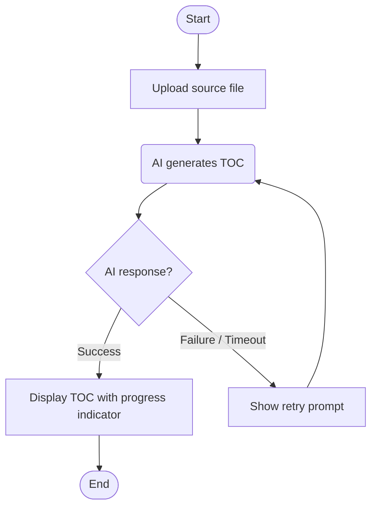

# Write Service Planning

Analyze the trigger document to determine scope, collect AS-IS/TO-BE flows via Q&A, and save the result to `docs/planning/YYYYMMDD-{feature-name}.md`.

---

## Phase 1: Scope Check (Autonomous Judgment)

Before asking the user anything, read the trigger document from the `docs/trigger/` directory.

- If multiple files exist, use the most recently modified one.
- If `docs/trigger/` does not exist or contains no files, output the message below and stop immediately.
  > "트리거 문서를 찾을 수 없습니다. `docs/trigger/` 에 트리거 문서를 먼저 작성해주세요."

Once the trigger document is read successfully, analyze its content and decide autonomously whether a service planning document is needed.

### Decision Criteria

Look for the following 3 signals in the trigger document:

- Does the change add new screens or user steps?
- Does the change reorder the existing user flow?
- Does the change affect two or more screens or features?

### Action Based on Decision

- **Planning needed (1 or more signals confirmed):** State the reasoning in one line and proceed to Phase 2 immediately.

  > 예: "새로운 업로드 스텝이 추가되는 변경으로 보여 기획 문서를 작성합니다."

- **Planning not needed (no signals, clear case):** State the reasoning, inform the user, and stop.

  > 예: "이 변경은 버튼 텍스트 수정으로, 기존 흐름에 영향이 없어 기획 문서를 건너뜁니다."

- **Ambiguous:** Explain what makes it unclear and ask one focused question to confirm with the user before proceeding.
  > 예: "이 변경이 기존 결제 흐름에 새로운 분기를 추가하는지 확인이 필요합니다. 그런가요?"

---

## Phase 2: Document Q&A

Information already available in the trigger document (trigger type, background, Problem Statement) is used directly without asking. Only the following 3 questions are asked.

**Q1. Please describe the current user flow (AS-IS) step by step.**

> Distinguish between user actions and system processes. Include branching points (success/failure).

**If the user doesn't know Q1:** Draft the AS-IS flow directly from the trigger document's Problem Statement (who, in what situation, what fails) and background context, then ask the user to confirm.

> "트리거 문서를 바탕으로 현재 흐름을 아래와 같이 정리했습니다. 맞나요? 수정할 부분이 있으면 알려주세요."

**Q2. Does this change include an AI feature?** (Yes / No)

Skip this question if AI involvement is already clear from the trigger document or conversation context.

**Q3. Please describe the desired flow after the change (TO-BE) step by step.**

> Focus on what differs from AS-IS. If Q2 is 'Yes', include AI failure branches (no response / timeout / empty response → retry prompt or manual input path).

**If the user doesn't know Q3:** Use the trigger document's expected outcome as a starting point and keep asking until all three of the following are confirmed. Do not start writing TO-BE until all three are filled in.

1. Which steps in AS-IS are removed or changed?
2. What new steps or branches are added?
3. What is the final state the user experiences after the change?

If the user gives a directional answer with no concrete flow (e.g., "더 좋아졌으면 해요"), keep asking for specifics.

---

## Phase 3: Document Generation and Save

### Problem Statement Rule

Use the Problem Statement from the trigger document as-is. Translate to English if needed since the document language is English.

If the trigger document's Problem Statement is missing or lacks any of the three elements below, stop immediately.

```
[누가] [어떤 상황에서] [무엇이] 안 된다.
```

> "트리거 문서의 Problem Statement가 불완전합니다. `docs/trigger/` 문서에 세 요소([누가] [어떤 상황에서] [무엇이] 안 된다)를 모두 채운 뒤 다시 실행해주세요."

### Feature Name Extraction Rule

Extract the core feature being added or changed from Q3 (TO-BE flow) as English kebab-case.
If Q3 is ambiguous, fall back to the trigger document's background context.

- Primary: extract from Q3 (e.g., "목차 생성 완료 시 상태 표시" → `progress-indicator`)
- Fallback: use trigger document background when Q3 is unclear (e.g., "목차 결과가 너무 일반적" + Q3 unclear → `toc-quality-improvement`)

### Mermaid Flowchart Rules

- Use `flowchart TD` format
- Node types:
  - User action: `[text]` (rectangle)
  - System process: `(text)` (rounded rectangle)
  - Branch point: `{text}` (diamond)
  - Start/End: `([text])` (stadium shape)
- If the change includes an AI feature, the TO-BE chart must include a failure branch

**Example (TO-BE with AI):**



### Output File Format

```markdown
# Service Planning: {Feature Name}

**Date:** YYYY-MM-DD
**Trigger Type:** {trigger document — trigger type}
**Trigger Source:** {trigger document — background context summary}

---

## Problem Statement

{trigger document — Problem Statement (translated to English)}

---

## AS-IS Flow

{Mermaid flowchart based on Q1}

---

## TO-BE Flow

{Mermaid flowchart based on Q3 (includes AI failure branch if Q2 is 'yes')}

---

## Scope Summary

- **Affected screens:** {list only items where changes occur, by comparing AS-IS and TO-BE nodes}
- **Key changes:** {bullet points of what differs in TO-BE}
- **Includes AI feature:** Yes / No
```

### Save Path

`docs/planning/YYYYMMDD-{kebab-case-feature-name}.md`

Create `docs/planning/` automatically if it does not exist. Do not ask the user to confirm.

### Document Language

Write all document content in English — section headings, Problem Statement, and Mermaid node text.

After saving, output the following message:

> "Service planning document saved: `docs/planning/YYYYMMDD-{feature-name}.md`
> Next step is feature planning. Write a case list and requirements doc for each node in the TO-BE flow."
